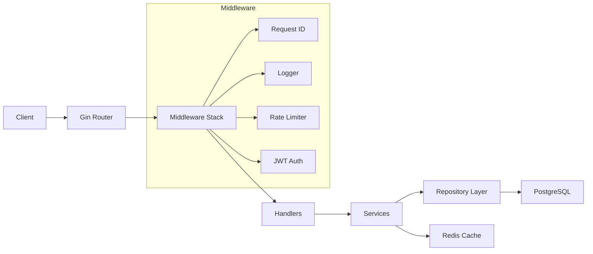
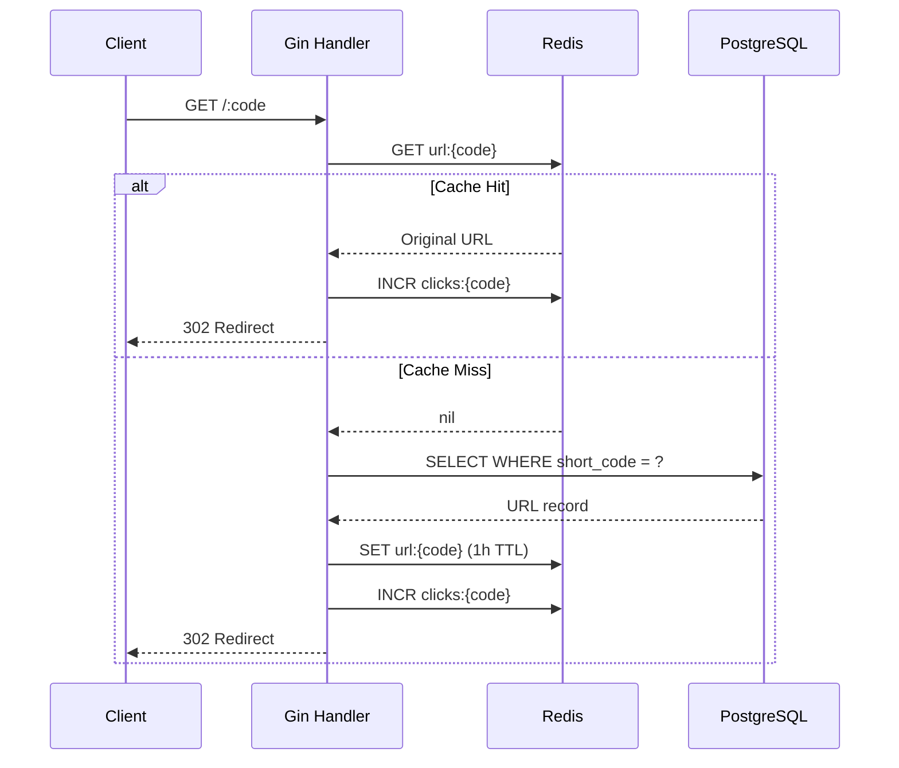

# URL Shortener — Project Analysis

## Overview

A **Go REST API** for URL shortening with user authentication, Redis caching, click analytics, and PostgreSQL persistence. Licensed under MIT, authored by Shivam Kumar.

| Attribute | Detail |
|---|---|
| **Language** | Go 1.25.6 |
| **Framework** | [Gin](https://github.com/gin-gonic/gin) v1.12.0 |
| **Database** | PostgreSQL 16 via [GORM](https://gorm.io/) v1.31.2 |
| **Cache** | Redis 7 via [go-redis](https://github.com/redis/go-redis) v9.21.0 |
| **Auth** | JWT (HS256) via [golang-jwt](https://github.com/golang-jwt/jwt) v5 |
| **Config** | [Viper](https://github.com/spf13/viper) + [godotenv](https://github.com/joho/godotenv) |
| **Logging** | [Zap](https://go.uber.org/zap) (structured, production mode) |
| **Deploy** | Multi-stage Dockerfile + Docker Compose |
| **Total Source Files** | ~20 Go files, ~1,600 LoC |

---

## Architecture



The project follows a **clean layered architecture**:

| Layer | Package | Responsibility |
|---|---|---|
| Entry | [main.go](file:///Users/shivamkumar/Desktop/url-shortener/cmd/server/main.go) | Bootstrap, graceful shutdown |
| Router | [router.go](file:///Users/shivamkumar/Desktop/url-shortener/internal/router/router.go) | Route definitions, DI wiring |
| Middleware | [middleware/](file:///Users/shivamkumar/Desktop/url-shortener/internal/middleware) | Request ID, logging, rate limiting, auth |
| Handler | [handler/](file:///Users/shivamkumar/Desktop/url-shortener/internal/handler) | HTTP request/response handling |
| Service | [service/](file:///Users/shivamkumar/Desktop/url-shortener/internal/service) | Business logic |
| Repository | [repository/](file:///Users/shivamkumar/Desktop/url-shortener/internal/repository) | Database operations |
| Model | [model/](file:///Users/shivamkumar/Desktop/url-shortener/internal/model) | GORM entity definitions |
| Utils | [utils/](file:///Users/shivamkumar/Desktop/url-shortener/internal/utils) | JWT, password hashing, short code generation |
| Config | [config.go](file:///Users/shivamkumar/Desktop/url-shortener/internal/config/config.go) | Environment-based configuration |
| Cache | [redis.go](file:///Users/shivamkumar/Desktop/url-shortener/internal/cache/redis.go) | Redis connection |
| Logger | [logger.go](file:///Users/shivamkumar/Desktop/url-shortener/internal/logger/logger.go) | Global Zap logger |

---

## API Routes

| Method | Path | Auth | Description |
|---|---|---|---|
| `GET` | `/health` | ✗ | Health check |
| `POST` | `/api/v1/auth/register` | ✗ | Register user (email + password) |
| `POST` | `/api/v1/auth/login` | ✗ | Login → returns JWT token |
| `POST` | `/api/v1/shorten` | ✓ | Create short URL |
| `GET` | `/api/v1/stats/:code` | ✓ | Get URL analytics (clicks, timestamps) |
| `GET` | `/:code` | ✗ | Redirect to original URL (302) |

All `/api/v1` routes are rate-limited (10 req/min per IP via Redis).

---

## Data Models

### User ([user.go](file:///Users/shivamkumar/Desktop/url-shortener/internal/model/user.go))
```
User {
    gorm.Model (ID, CreatedAt, UpdatedAt, DeletedAt)
    Email        string  (unique index)
    PasswordHash string
    URLs         []URL   (has-many)
}
```

### URL ([url.go](file:///Users/shivamkumar/Desktop/url-shortener/internal/model/url.go))
```
URL {
    gorm.Model (ID, CreatedAt, UpdatedAt, DeletedAt)
    UserID       uint
    ShortCode    string     (unique index)
    OriginalURL  string
    ClickCount   int
    LastAccessed *time.Time
}
```

---

## Key Data Flow: URL Redirect



---

## Strengths

1. **Clean separation of concerns** — Handler → Service → Repository layers are well-isolated
2. **Redis caching** — URL lookups hit Redis first with a 1-hour TTL, reducing DB pressure
3. **Atomic click counting** — Redis `INCR` for fast, concurrent-safe analytics
4. **Cryptographically secure short codes** — Uses `crypto/rand`, not `math/rand`
5. **Collision handling** — Retry loop until a unique short code is generated
6. **Duplicate URL detection** — Returns existing short URL if same user + URL pair already exists
7. **Graceful shutdown** — Handles SIGINT/SIGTERM, drains connections with 5s timeout
8. **Multi-stage Docker build** — Minimal Alpine runtime image with non-root `appuser`
9. **Request tracing** — UUID-based `X-Request-ID` header on every response
10. **Input validation** — Gin's binding tags enforce email format, password length, URL format

---

## Issues & Improvement Opportunities

### 🔴 Critical / Security

| # | Issue | File | Detail |
|---|---|---|---|
| 1 | **Hardcoded JWT secret** | [jwt.go:9](file:///Users/shivamkumar/Desktop/url-shortener/internal/utils/jwt.go#L9) | `jwtSecret = []byte("secret-key")` — Must be loaded from env/config |
| 2 | **Unsafe type assertion** | [url_handler.go:74-75](file:///Users/shivamkumar/Desktop/url-shortener/internal/handler/url_handler.go#L74-L75) | `userIDValue.(uint)` panics if key is missing — use comma-ok pattern |
| 3 | **Click counts never sync to DB** | [url_service.go](file:///Users/shivamkumar/Desktop/url-shortener/internal/service/url_service.go) | Redis `clicks:{code}` counters are incremented but **never written back** to PostgreSQL. `GetStats` returns stale `ClickCount` from DB, and `LastAccessed` is never updated |
| 4 | **`.env` committed to repo** | [.env](file:///Users/shivamkumar/Desktop/url-shortener/.env) | Contains DB credentials. It's in `.gitignore` but already tracked by Git |

### 🟡 Moderate

| # | Issue | Detail |
|---|---|---|
| 5 | **No interfaces** | Repository and service layers use concrete types, making unit testing difficult |
| 6 | **Race condition in rate limiter** | `INCR` + `EXPIRE` in [rate_limiter.go](file:///Users/shivamkumar/Desktop/url-shortener/internal/middleware/rate_limiter.go) are not atomic — use a Lua script or `SET NX EX` pattern |
| 7 | **Global logger** | `logger.Log` is a package-level global — should be injected via context or struct for testability |
| 8 | **`panic` on startup errors** | [database.go](file:///Users/shivamkumar/Desktop/url-shortener/internal/database/database.go), [redis.go](file:///Users/shivamkumar/Desktop/url-shortener/internal/cache/redis.go) — return errors instead for cleaner error handling |
| 9 | **Mixed logging** | Uses both `fmt.Println` (database, cache) and `zap` (middleware, main) — should be consistent |
| 10 | **`SHORT_URL` base is hardcoded** | [url_handler.go:100](file:///Users/shivamkumar/Desktop/url-shortener/internal/handler/url_handler.go#L100) — `"http://localhost:8080/"` should come from config |

### 🟢 Minor / Nice to Have

| # | Suggestion |
|---|---|
| 11 | Add a `README.md` with API documentation, setup instructions, and examples |
| 12 | Add unit tests — currently **zero test files** in the project |
| 13 | Add a `DELETE` endpoint for URLs |
| 14 | Add URL expiration support (TTL field on the model) |
| 15 | Add pagination to a "list my URLs" endpoint |
| 16 | Add CORS middleware for frontend integration |
| 17 | Add a background worker to flush Redis click counts to PostgreSQL periodically |
| 18 | Use `go:embed` or config for the short URL domain/base URL |
| 19 | All dependencies marked `// indirect` — should distinguish direct vs indirect requires |

---

## File Tree Summary

```
url-shortener/
├── cmd/server/
│   └── main.go                    # Entry point, graceful shutdown
├── internal/
│   ├── cache/redis.go             # Redis connection
│   ├── config/config.go           # Viper + dotenv config
│   ├── database/database.go       # GORM PostgreSQL + auto-migrate
│   ├── handler/
│   │   ├── auth_handler.go        # Register / Login handlers
│   │   └── url_handler.go         # Shorten / Redirect / Stats handlers
│   ├── logger/logger.go           # Zap logger init
│   ├── middleware/
│   │   ├── auth.go                # JWT Bearer token validation
│   │   ├── logger.go              # Request logging (method, path, status, latency)
│   │   ├── rate_limiter.go        # Redis-based IP rate limiting (10/min)
│   │   └── request_id.go          # UUID request tracing
│   ├── model/
│   │   ├── url.go                 # URL entity (ShortCode, OriginalURL, ClickCount)
│   │   └── user.go                # User entity (Email, PasswordHash)
│   ├── repository/
│   │   ├── url_repository.go      # URL CRUD operations
│   │   └── user_repository.go     # User CRUD operations
│   ├── router/router.go           # Route definitions + DI wiring
│   ├── service/
│   │   ├── auth_service.go        # Register + Login business logic
│   │   └── url_service.go         # URL shortening + caching + analytics
│   └── utils/
│       ├── jwt.go                 # JWT generate + validate
│       ├── password.go            # bcrypt hash + compare
│       └── shortcode.go           # Crypto-random short code generation
├── Dockerfile                     # Multi-stage build (alpine)
├── docker-compose.yml             # API + PostgreSQL 16 + Redis 7
├── go.mod / go.sum
├── .env / .gitignore / .dockerignore
└── LICENSE (MIT)
```
